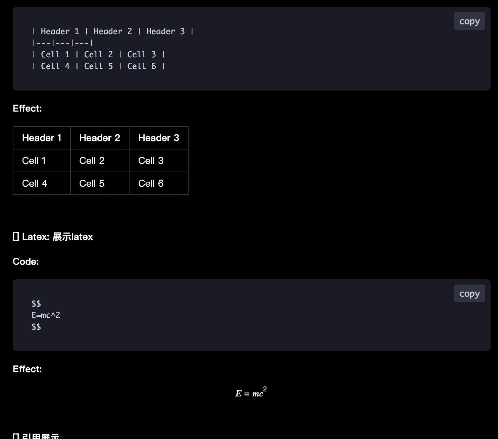

# example-markdown-message-block

> markdown message block component for react



## usage

```tsx
import { useState } from 'react';
import './App.css'
import 'example-markdown-message-block/src/index.css'
import MarkdownMessageBlock from 'example-markdown-message-block'

function App() {
  const [message, setMessage] = useState('Hello, World!') 
  const styles = {
    padding: '20px',
    border: '2px solid #000',
    borderRadius: '5px',
    marginBottom: '20px',
    color: '#fff',
    backgroundColor: '#f00',
    width: '50%'
  };


  return (
    <>
      <div>
        {/* <input type="text" value={message} onChange={e => setMessage(e.target.value)} /> */}
        <textarea  
      value={message}  
      onChange={e => setMessage(e.target.value)}  
      rows={4} // 可选：设置初始行数  
      cols={50} // 可选：设置初始列数  
    />  
        <hr />
        <MarkdownMessageBlock styles={styles} message={message} />
      </div>
    </>
  )
}

export default App

```